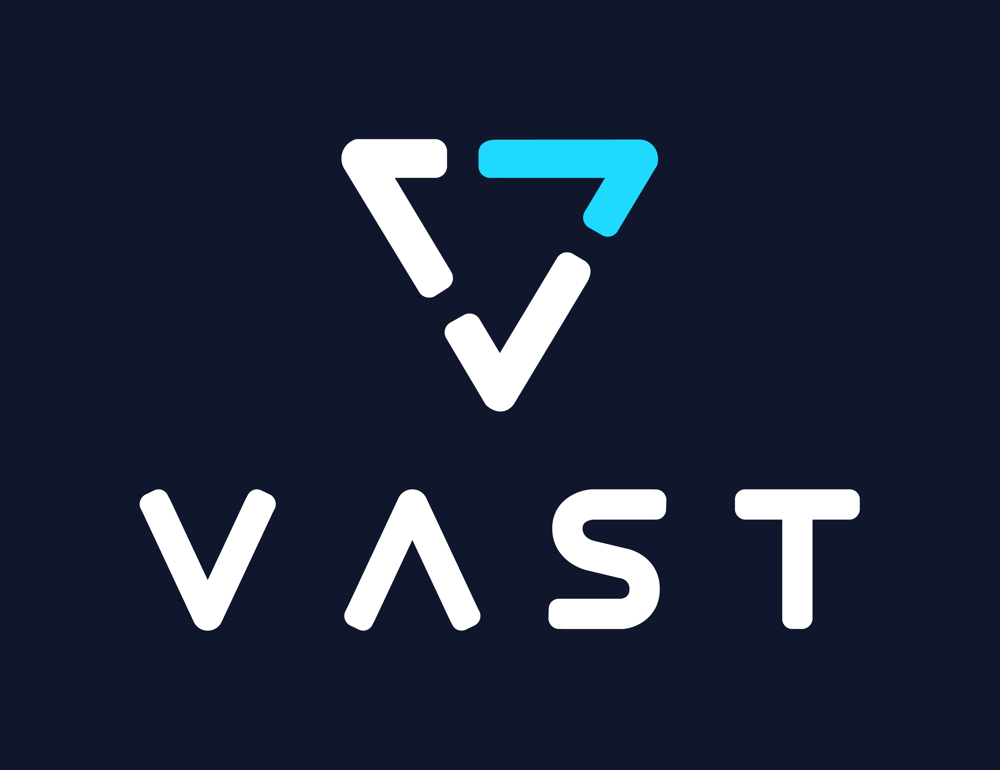

<p align="center">
  
</p>

---

# VUA

VUA is library code for LLM inference engines for external storage of KV caches.


## VUA as plugin to vLLM 0.8.5 and above

With vLLM 0.8.5 and above, the following is supported:

- Prefix search (chunk size is based on `--max-num-batched-tokens` parameter).
- Tensor parallelism
- KV cache load via GDS

Utilize the vLLM KV Connector plugin by importing it before running vLLM.

```
from vua.vllm.kv_connector_v1 import VUAStorageConnector_V1
```

**Or** use the wrapper that comes with this package:

```
bin/vua-vllm serve <parameters>
```

Where in `parameters`, you can pass the KV connector configuration, e.g:

```
--kv-transfer-config '{"kv_connector":"VUAStorageConnector_V1","kv_role":"kv_both","kv_connector_extra_config": {"shared_storage_path": "/mnt/shared-storage"}}'
```

See [guide](doc/kv-connector-v1.md) on how to see to measure performance using this connector.


## Standalone VUA Core

There is also standalone library code that LLM engines can use.


### Developer Quick Start

1. **Understanding VUA core**

   VUA splits tokens into groups defined by a fixed split factor (see `VUAConfig.split_factor`). Token prefixes are hashes and converted to directory names where cache data is stored. The `put()` method splits key-value caches and stores fragmented tensor data into these directories, while `get_closest()` fetches the closest matching cache fragment based on supplied token prefixes.

2. **Exploring the Codebase**

   - **`src/vua/core.py`**: Contains the primary VUA implementation with `put()` and `get_closest()`, plus token-to-path conversion logic.
   - **`src/vua/serdes.py`**: Provides tensor serialization/deserialization functions (`tensor_to_bytes` and `bytes_to_tensor`) for efficiently handling PyTorch tensors. Compatible to safetensors.
   - **`tests/test_vua.py`**: Offers tests to validate token processing, cache storage and retrieval, and tensor serialization.

3. **Running the Tests**

   Run the tests by executing:
   ```bash
   uv run python -m unittest discover -s tests
   ```
4. **Using VUA in Your Project**

   - Create a VUA instance by providing a configuration (e.g. `VUAConfig`) and a directory path for cache storage.
   - Utilize `put()` to store computed key-value caches and `get_closest()` to retrieve cached data based on token queries.
   - **Batched Operations:** VUA supports batched put and get operations. If you provide a 2D tensor of tokens to `put()`, it processes each sequence in parallel. Similarly, calling `get_closest()` with a list of token tensors returns a list of corresponding `ClosestKV` results.

   **Example:**

   ```python
   import os
   import torch
   from vua.core import VUA, VUAConfig

   # Set up cache storage directory
   cache_dir = "./vua_cache"
   os.makedirs(cache_dir, exist_ok=True)

   # Create a VUA instance
   vua = VUA(VUAConfig, cache_dir)

   # Generate sample tokens ensuring the length is divisible by split_factor
   tokens = torch.randint(0, 0xFFFF, (1, 512), dtype=torch.uint16)
   trimmed_tokens = VUAConfig.trim_to_split_factor(tokens)

   # Create a sample key-value cache (for demonstration purposes)
   # This is a list with one layer and two tensor pairs (keys and values)
   kvcache = [[torch.randn(1, 2, trimmed_tokens.size(1), 64), torch.randn(1, 2, trimmed_tokens.size(1), 64)]]

   # Store the cache using put()
   vua.put(trimmed_tokens, kvcache)

   # Retrieve the cache using get_closest()
   result = vua.get_closest(trimmed_tokens, device="cpu")
   print("Retrieved tokens:", result.tokens)
   print("Retrieved data:", result.data)
   ```

5. **Examples directory**

   The examples directory contains two main use cases:

   - Usage with 'transformers' library

   ```
   uv run python ./example/on-transformers.py
   ```

   - Usage to experimental vLLM V0 connector for offline kvcache storage using VUA core:

   ```
   uv run ./example/serve-vllm.sh
   ```


6. **Debugging and Logging**

   VUA leverages Python’s `logging` module for detailed debug output. Configure custom log handlers during development to monitor directory navigation and cache operations effectively.

# License

VUA is released under the Apache License Version 2.0.

See the file LICENSE for more details.
